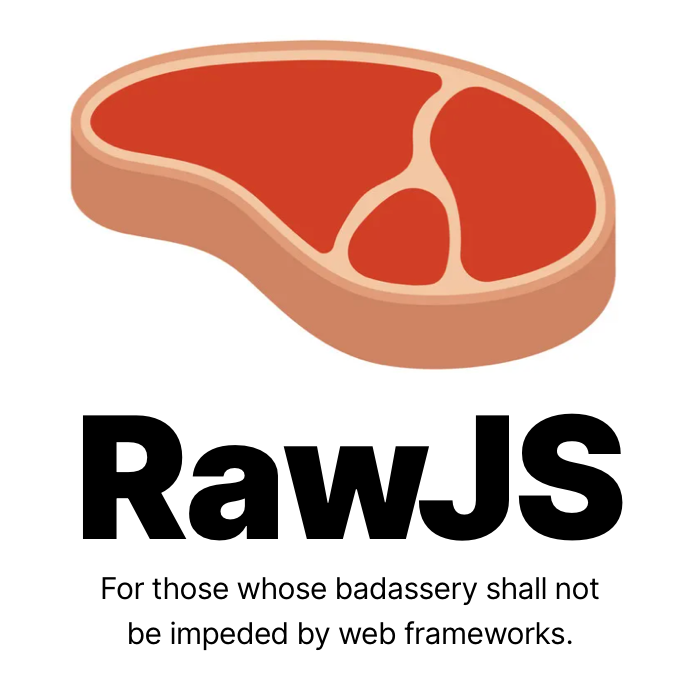

<p align="center">
	
</p>

[](https://twitter.com/intent/tweet?text=Is%20React%20too%20complicated%3F%20Give%20Raw.js%20a%20go.&url=https://github.com/squaresapp/rawjs)

## What is RawJS?

RawJS an **ultra-ergonomic HTML element construction library** that is designed to facilitate the construction of complex user interfaces with in a zero-magic, vanilla TypeScript style. Call functions. Create HTMLElement objects with event bindings and CSS styling attached. That's it.

It turns out, this is all you need to create complex interactive UIs. **You don't need React, Vue, Angular, Svelte**, or any of the others. These things are complicated UI sub-systems that run around behind the scenes and do a bunch of weird magic for you in order to keep your view in sync with your data. You have to do things their way, otherwise, the magic won't work.

Frameworks tend to do a lot of reinventing of what you can already do in JavaScript. By making controllers that are just plain TypeScript classes, and using the DOM directly to store your view state, you can cut complexities associated with model/view synchronization. Some devs will shudder at this. But this technique can **vastly** reduce total project complexity. Code gets easier to debug. WTF moments reduce in frequency. Total project risk goes down.

## RawJS Features:

- No learning curve beyond knowing how to work the DOM.
- No props / state / special controller classes that need to be inherited.
- No weird or unpredictable framework "magic".
- No bloat. The whole library is only **2.3KB**.
- No performance overhead.
- No virtual DOM.
- No JSX required (though it works with JSX if that's your thing).
- **No external CSS / SASS / LESS** files needed. Write your CSS in TypeScript, and get all the benefits of styling becoming just another part of the code.
- **No more asking StackOverflow: "How do I do X in framework Y?"**. RawJS gives it to you raw. It's just you and the DOM. Do whatever makes sense.

Also:

- RawJS is being used in production (see [Squares](https://squaresapp.org/) and [Homello](https://www.homello.io)).
- Many years in the making. Has passed through many different design variations.
- Works as a `<script>` include, as a module, or as a `require()`.
- Works in Node.js for server-side HTML generation (with the help of HappyDOM).

## Watch Paul Gordon's Talk on RawJS at TorontoJS

[](https://www.youtube.com/embed/nsXjS5J-6CM)

## Installation

```html
<script src="https://cdn.jsdelivr.net/npm/@squaresapp/rawjs/raw.min.js"></script>
```
Or
```
npm install @squaresapp/rawjs --save
```

## Usage

For ES Modules usage:
```typescript
import { raw } from "@squaresapp/rawjs";

document.body.append(
	raw.div(
		{
			padding: "100px",
			background: "red",
		},
		raw.on("click", () => alert("Hello world"))
	)
);
```

For global usage:
```typescript
document.body.append(
	raw.div(
		{
			padding: "100px",
			background: "red",
		},
		raw.on("click", () => alert("Hello world"))
	)
);
```

See more examples at the [quickstart](quickstart.md).


